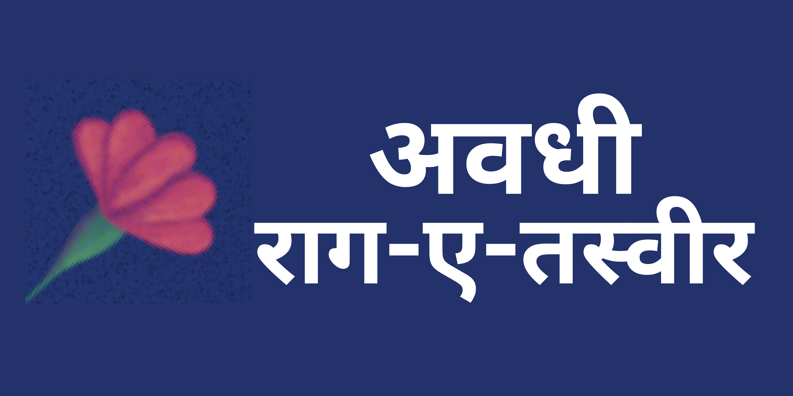

## Freelancing Project

It is my client's (`Apoorv Anurag`) post-graduation project for Interaction Design presented and awarded at IDC School of Design, IIT Bombay.

## FAQ

#### Project Overview

Awadhi-Raag-E-Tasweer is a responsive webapp build for tablet specific exhibition installation. It allows users to curate a personalised photo playlist of Awadhi songs which can be both printed or emailed to them.

#### Project Vision

The project aims to raise awareness and shift negative perceptions of the Awadhi mother tongue. We developed an interactive installation based on research-driven strategies and themes highlighting the significance and relevance of Awadhi language.

## Try Here

- [Website](https://awadhi-raag-e-tasweer.vercel.app/)

## Demo

- [Video](https://www.youtube.com/watch?v=FyAP7g6YUSE)

